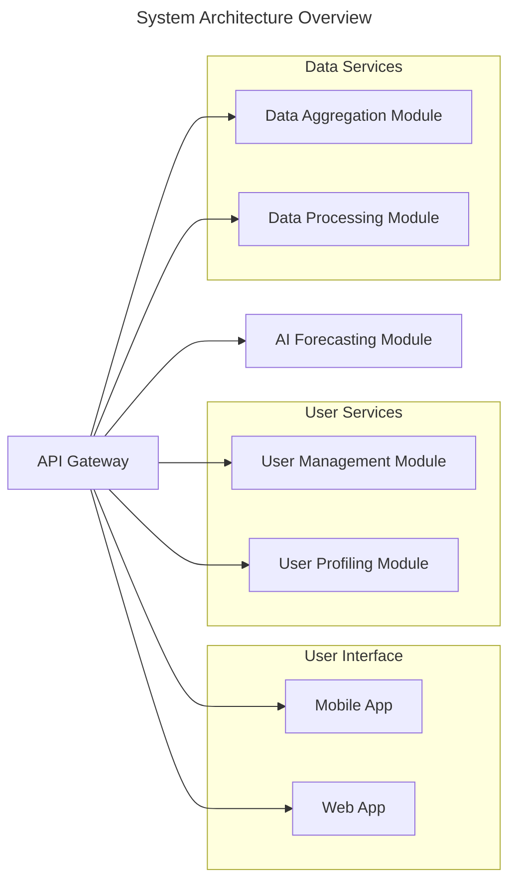
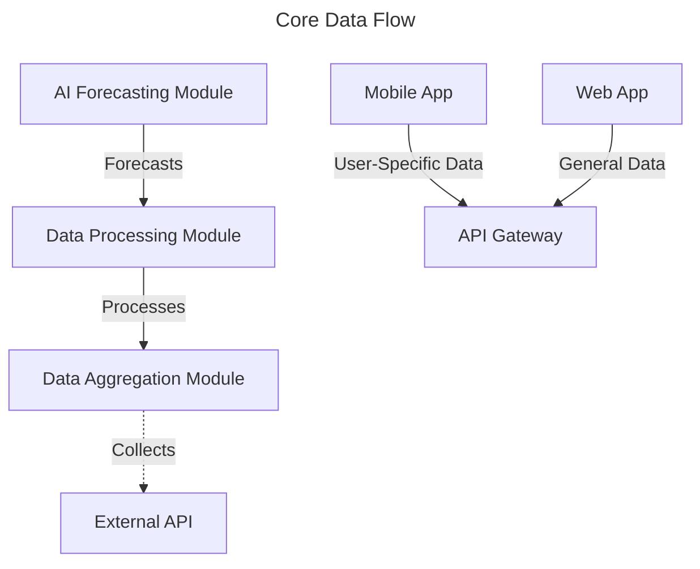
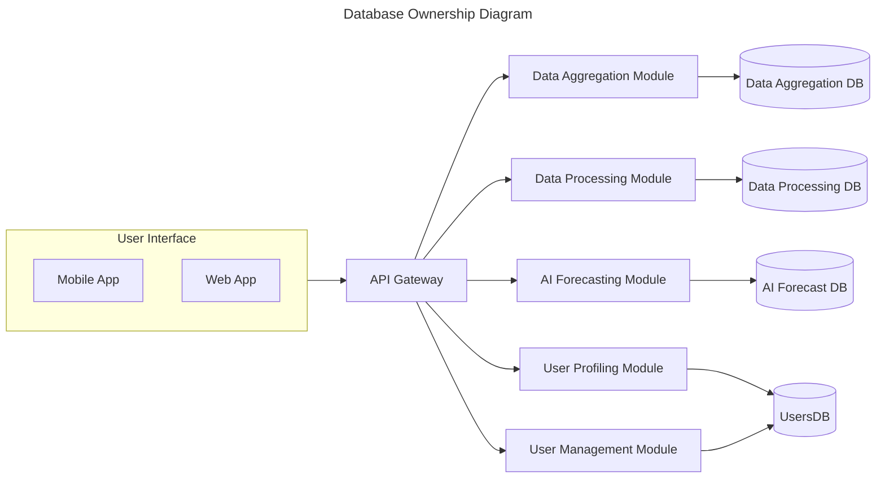

# System Architecture

```mermaid
---
title: System Architecture Overview
---
graph LR
    subgraph UserInterface[User Interface]
        MobileApp[Mobile App]
        WebApp[Web App]
    end

    subgraph UserServices[User Services]
        UserManagement[User Management Module]
        UserProfile[User Profiling Module]
    end

    subgraph DataServices[Data Services]
        DataAgg[Data Aggregation Module]
        DataProc[Data Processing Module]
    end

    APIGateway[API Gateway] --> DataAgg
    APIGateway --> DataProc
    APIGateway --> AIModule[AI Forecasting Module]
    APIGateway --> UserManagement
    APIGateway --> UserProfile
    APIGateway --> MobileApp
    APIGateway --> WebApp
```

```mermaid
---
title: Core Data Flow
---
graph TD
    DataAgg[Data Aggregation Module] -.->|Collects| SensorData[External API]
    DataProc[Data Processing Module] -->|Processes| DataAgg
    AIModule[AI Forecasting Module] -->|Forecasts| DataProc
    MobileApp[Mobile App] -->|User-Specific Data| APIGateway[API Gateway]
    WebApp[Web App] -->|General Data| APIGateway
```

```mermaid
---
title: Database Ownership Diagram
---
graph LR
    %% Define Modules and Their Databases
    DataAgg[Data Aggregation Module] --> DataAggDB[(Data Aggregation DB)]
    DataProc[Data Processing Module] --> DataProcDB[(Data Processing DB)]
    AIModule[AI Forecasting Module] --> AIDB[(AI Forecast DB)]
    UserProfile[User Profiling Module] --> UsersDB[(UsersDB)]
    UserManagement[User Management Module] --> UsersDB[(UsersDB)]

    %% User Interface Components Communicating via API Gateway
    subgraph UserInterface[User Interface]
        MobileApp[Mobile App]
        WebApp[Web App]
    end

    %% API Gateway Communicating with Modules
    UserInterface --> APIGateway[API Gateway]
    APIGateway --> DataAgg
    APIGateway --> DataProc
    APIGateway --> AIModule
    APIGateway --> UserProfile
    APIGateway --> UserManagement
```

