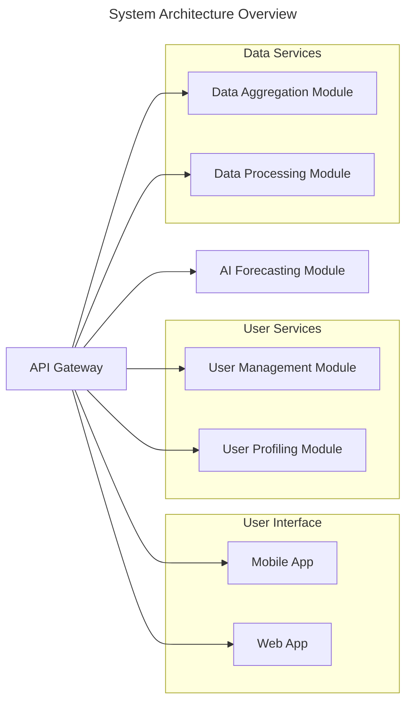
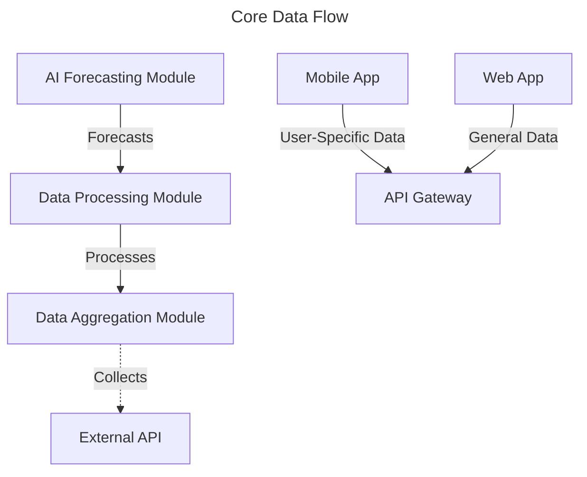
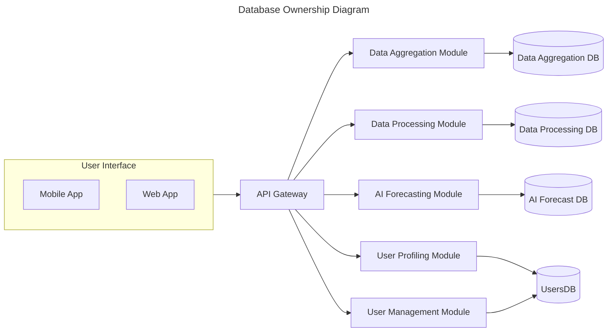
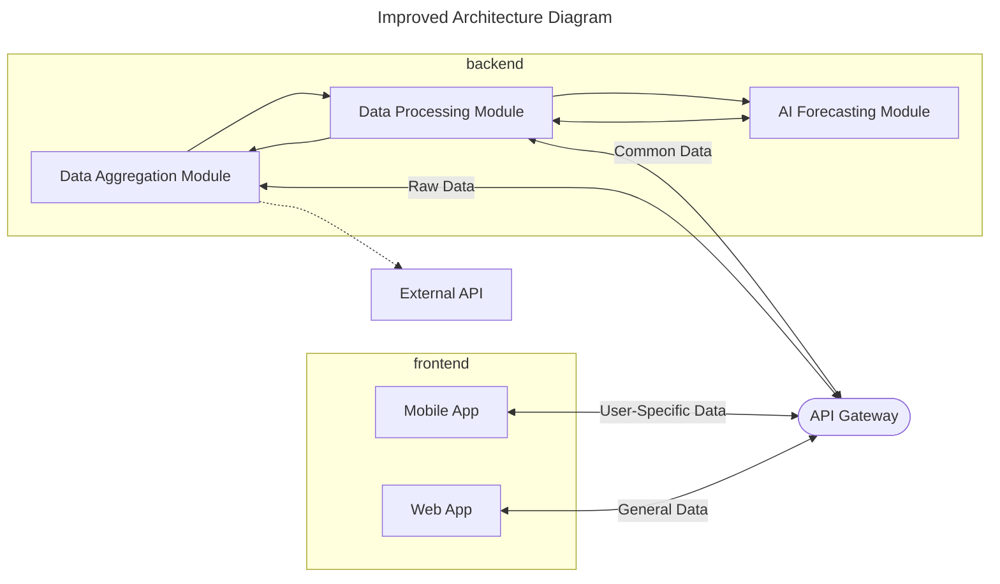

# System Architecture

The system follows a microservices architecture and consists of the following components:

- **Data Aggregation Module**: Collects data from environmental sensors.
- **Data Processing Module**: Processes and refines collected data.
- **AI Forecasting Module**: Provides predictions based on processed data.
- **Mobile App**: Presents user-specific data and notifications.
- **Web App**: Displays general environmental data for all users.
- **API Gateway**: Manages communication and routes requests between modules.
- **User Profiling Module**: Tailors data presentation based on user profiles.
- **User Management Module**: Manages user accounts, permissions, and roles.

Here’s a visual representation of the architecture:

# Improved Architecture Diagram 

